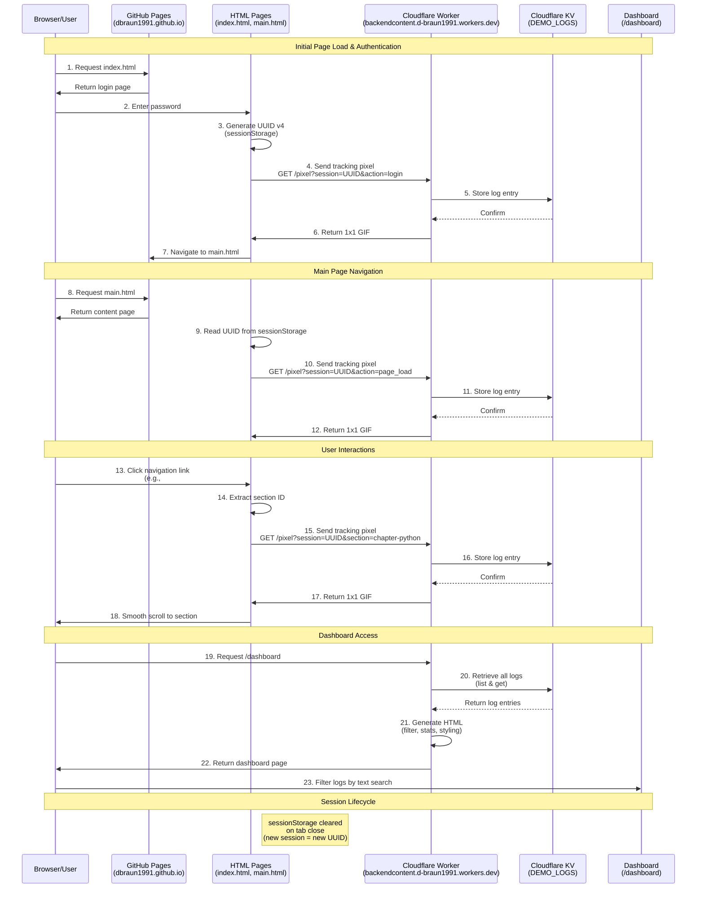

```mermaid
sequenceDiagram
    participant User as Browser/User
    participant GHP as GitHub Pages<br/>(dbraun1991.github.io)
    participant HTML as HTML Pages<br/>(index.html, main.html)
    participant CFW as Cloudflare Worker<br/>(backendcontent.d-braun1991.workers.dev)
    participant KV as Cloudflare KV<br/>(DEMO_LOGS)
    participant Dashboard as Dashboard<br/>(/dashboard)

    Note over User,Dashboard: Initial Page Load & Authentication

    User->>GHP: 1. Request index.html
    GHP->>User: Return login page
    User->>HTML: 2. Enter password
    HTML->>HTML: 3. Generate UUID v4<br/>(sessionStorage)
    HTML->>CFW: 4. Send tracking pixel<br/>GET /pixel?session=UUID&action=login
    CFW->>KV: 5. Store log entry
    KV-->>CFW: Confirm
    CFW->>HTML: 6. Return 1x1 GIF
    HTML->>GHP: 7. Navigate to main.html

    Note over User,Dashboard: Main Page Navigation

    User->>GHP: 8. Request main.html
    GHP->>User: Return content page
    HTML->>HTML: 9. Read UUID from sessionStorage
    HTML->>CFW: 10. Send tracking pixel<br/>GET /pixel?session=UUID&action=page_load
    CFW->>KV: 11. Store log entry
    KV-->>CFW: Confirm
    CFW->>HTML: 12. Return 1x1 GIF

    Note over User,Dashboard: User Interactions

    User->>HTML: 13. Click navigation link<br/>(e.g., #chapter-python)
    HTML->>HTML: 14. Extract section ID
    HTML->>CFW: 15. Send tracking pixel<br/>GET /pixel?session=UUID&section=chapter-python
    CFW->>KV: 16. Store log entry
    KV-->>CFW: Confirm
    CFW->>HTML: 17. Return 1x1 GIF
    HTML->>User: 18. Smooth scroll to section

    Note over User,Dashboard: Dashboard Access

    User->>CFW: 19. Request /dashboard
    CFW->>KV: 20. Retrieve all logs<br/>(list & get)
    KV-->>CFW: Return log entries
    CFW->>CFW: 21. Generate HTML<br/>(filter, stats, styling)
    CFW->>User: 22. Return dashboard page
    User->>Dashboard: 23. Filter logs by text search

    Note over User,Dashboard: Session Lifecycle
    Note right of HTML: sessionStorage cleared<br/>on tab close<br/>(new session = new UUID)
```